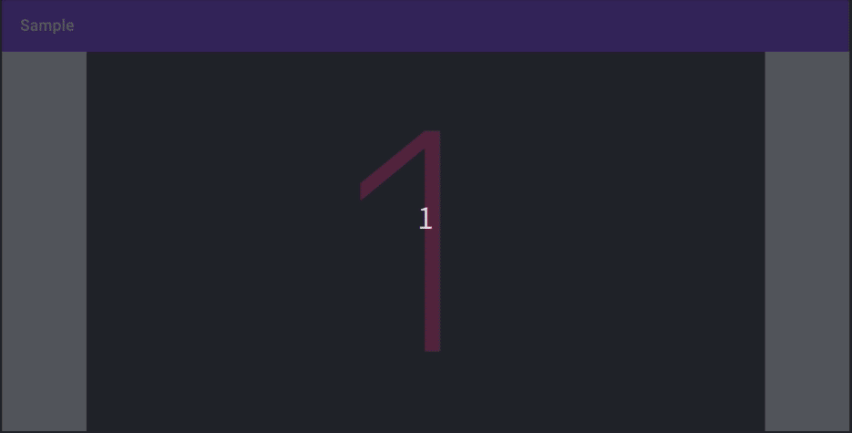

# Slideshow

 [  ](https://bintray.com/kaleidot725/slideshow/slideshow-ui/0.1.0/link)

Slideshow is Android library for previewing multiple images.



# Quick Start

Place `SlideShowView` to Activity or Fragment layout file.

```xml
<?xml version="1.0" encoding="utf-8"?>
<FrameLayout xmlns:android="http://schemas.android.com/apk/res/android"
    xmlns:tools="http://schemas.android.com/tools"
    android:layout_width="match_parent"
    android:layout_height="match_parent"
    tools:context=".MainActivity">

    <jp.kaleidot725.slideshow.SlideshowView
        android:id="@+id/slide_show_view"
        android:layout_width="match_parent"
        android:layout_height="match_parent"
        android:layout_gravity="center" />

</FrameLayout>
```

Request Previewing Multiple Image to `SlideShowView`.

```kotlin
override fun onCreate(savedInstanceState: Bundle?) {
    super.onCreate(savedInstanceState)
    slide_show_view.slides = DEFAULT_SLIDES
    slide_show_view.scaleType = DEFAULT_SCALE_TYPE
    slide_show_view.interval = DEFAULT_INTERVAL
    slide_show_view.inAnimation = DEFAULT_IN_ANIMATION
    slide_show_view.outAnimation = DEFAULT_OUT_ANIMATION
}

override fun onResume() {
    super.onResume()
    slide_show_view.start()
}

override fun onPause() {
    super.onPause()
    slide_show_view.stop()
}
```

